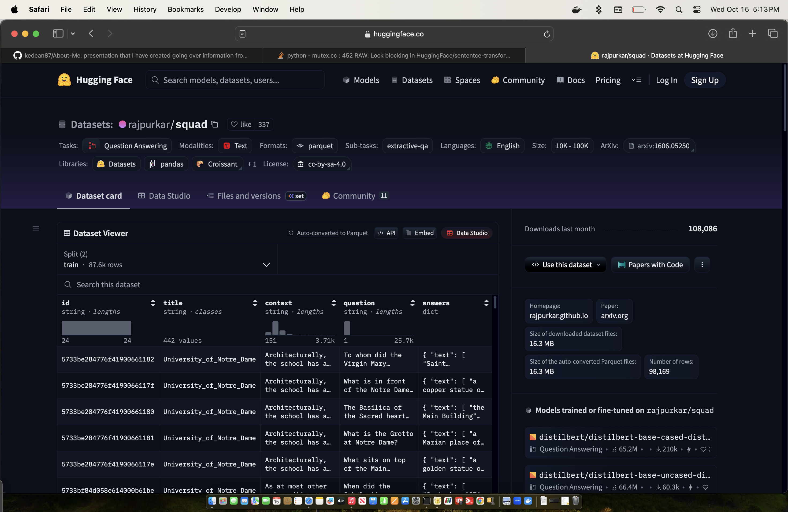
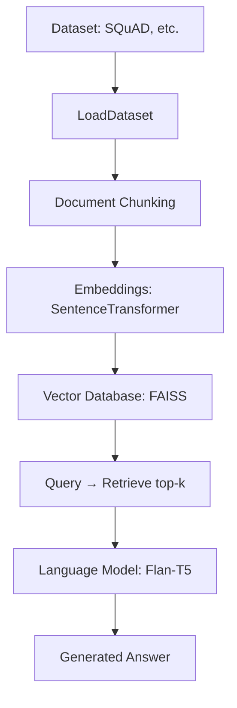

# Retrieval-Augmented Question Answering (RAG) Pipeline

This repository demonstrates a **Retrieval-Augmented QA pipeline** built with Python. The pipeline integrates:

- **Dataset loading** using Hugging Face datasets
- **Text chunking** and preprocessing
- **Embeddings** with `sentence-transformers`
- **Vector similarity search** with FAISS
- **Language model generation** using `transformers` (Flan-T5)
- A **pipeline class** to orchestrate retrieval and generation

The pipeline is designed to take queries, retrieve the most relevant passages from a dataset, and generate an answer using a language model.


> Image of Hugging Face Viewer showing the dataset.

---

## Pipeline Overview

1. **Load Dataset**  
   `LoadDataset` loads a Hugging Face dataset (default: SQuAD) and extracts textual documents.

2. **Chunk Documents**  
   `Database` splits each document into smaller chunks based on sentence tokenization, with configurable token limits and overlap.

3. **Compute Embeddings**  
   Sentence embeddings are computed using `sentence-transformers` and normalized for similarity search.

4. **Build Vector Index**  
   A FAISS index is created for fast retrieval. If FAISS is unavailable, a brute-force similarity search is used.

5. **Query and Retrieve**  
   Queries are encoded into embeddings, and the top-k most similar chunks are retrieved from the index.

6. **Answer Generation**  
   The retrieved chunks are fed to a language model (Flan-T5), which generates a natural language answer.

---

## Diagram


---

## Usage

```bash
# Activate virtual environment
source rag-venv/bin/activate

# Run the main pipeline demo
python main.py
```

## Output Example

Here are sample outputs from running the demo with three questions:

### 1. Query 1
`Question: What is the main idea of the passage?`

**Top retrieved passages:**
- Architecturally, the school has a Catholic character. Atop the Main Building's gold dome is a golden statue of the Virgin Mary...
- Architecturally, the school has a Catholic character. Atop the Main Building's gold dome is a golden statue of the Virgin Mary...
- Architecturally, the school has a Catholic character. Atop the Main Building's gold dome is a golden statue of the Virgin Mary...
- Architecturally, the school has a Catholic character. Atop the Main Building's gold dome is a golden statue of the Virgin Mary...

**Generated Answer:**
- Architecturally, the school has a Catholic character.

### 2. Query 2
`Question: Who was mentioned in the passage?`

**Top retrieved passages:**
- In 1842, the Bishop of Vincennes, Célestine Guynemer de la Hailandière, offered land to Father Edward Sorin...
- In 1842, the Bishop of Vincennes, Célestine Guynemer de la Hailandière, offered land to Father Edward Sorin...
- In 1842, the Bishop of Vincennes, Célestine Guynemer de la Hailandière, offered land to Father Edward Sorin...
- In 1842, the Bishop of Vincennes, Célestine Guynemer de la Hailandière, offered land to Father Edward Sorin...

**Generated Answer:**
- [Passage 4]

### 3. Query 3
`Question: When did the event occur?`

**Top retrieved passages:**
- In 1882, Albert Zahm (John Zahm's brother) built an early wind tunnel used to compare lift to drag of aeronautical models...
- In 1882, Albert Zahm (John Zahm's brother) built an early wind tunnel used to compare lift to drag of aeronautical models...
- In 1882, Albert Zahm (John Zahm's brother) built an early wind tunnel used to compare lift to drag of aeronautical models...
- In 1882, Albert Zahm (John Zahm's brother) built an early wind tunnel used to compare lift to drag of aeronautical models...

**Generated Answer:**
-1882

