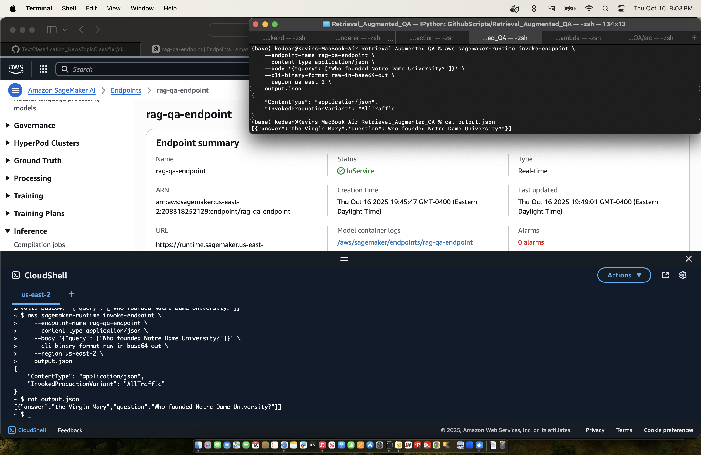

# Retrieval-Augmented QA on AWS SageMaker

This repository demonstrates how to deploy a **Retrieval-Augmented QA (RAG) pipeline** on AWS SageMaker using Docker. It includes step-by-step instructions from creating the Docker image to testing the SageMaker endpoint. 

---

## Table of Contents

- [Overview](#overview)
- [Prerequisites](#prerequisites)
- [Docker Image Setup](#docker-image-setup)
- [Push to Amazon ECR](#push-to-amazon-ecr)
- [Create SageMaker Model and Endpoint](#create-sagemaker-model-and-endpoint)
- [Testing the Endpoint](#testing-the-endpoint)
- [Issues Encountered & Solutions](#issues-encountered--solutions)
- [Cleanup](#cleanup)

---

## Overview

This project demonstrates:

1. Building a Docker image for a RAG QA pipeline.
2. Deploying it on AWS SageMaker.
3. Sending test queries to the endpoint using `curl`.

The RAG pipeline consists of:

- **`serve.py`** – Entry point for running the pipeline.
- **`main.py`** - File for local testing, not on SageMaker.
- **`pipeline.py`** – Coordinates dataset loading, embeddings, retrieval, and generation.
- **`vector_database.py`** – Handles chunking, embeddings, and FAISS indexing.
- **`model.py`** – Loads the language model.
- **`load_dataset.py`** – Loads and preprocesses the dataset.
- **Dependencies** – `torch`, `transformers`, `sentence-transformers`, `faiss`, `flask`, `nltk`, etc.

---

## Prerequisites

- AWS CLI configured with credentials and default region (`us-east-2` in this example).
- Docker installed.
- An AWS account with permissions for:
  - SageMaker
  - ECR
  - IAM roles (for SageMaker execution)

---

## Docker Image Setup

1. **Build the Docker image (CPU-only to reduce size):**
```bash
export DOCKER_BUILDKIT=1
docker buildx build --provenance=false --output type=docker --platform linux/amd64 -t rag-qa .
```

2. **Run locally to test:**
```bash
docker run --platform linux/amd64 -p 8080:8080 rag-qa
```

3. **Test the Flask server locally:**
```bash
curl -X POST "http://localhost:8080/invocations" \
     -H "Content-Type: application/json" \
     -d '{"query": ["Who founded Notre Dame University?"]}'
```

---

## Push to Amazon ECR

1. **Authenticate Docker to ECR**
```bash
aws ecr get-login-password --region us-east-2 | docker login --username AWS --password-stdin <your-account-id>.dkr.ecr.us-east-2.amazonaws.com
```

2. **Create an ECR repository (if not already created):**
```bash
aws ecr create-repository --repository-name rag-qa --region us-east-2
```

3. **Tag and push Docker image:**
```bash
docker tag rag-qa:latest <your-account-id>.dkr.ecr.us-east-2.amazonaws.com/rag-qa:latest
docker push <your-account-id>.dkr.ecr.us-east-2.amazonaws.com/rag-qa:latest
```

---

## Create SageMaker Model and Endpoint

1. **Create an execution role in AWS console**
- use `execution role arn` that is generated as the argument in `create-model` function

2. **Create the SageMaker model:**
```bash
aws sagemaker create-model \
    --model-name rag-qa \
    --primary-container Image=<your-account-id>.dkr.ecr.us-east-2.amazonaws.com/rag-qa:latest \
    --execution-role-arn arn:aws:iam::<your-account-id>:role/sagemaker-role-rag-qa \
    --region us-east-2
```

3. **Create Endpoint configuration:**
```bash
aws sagemaker create-endpoint-config \
    --endpoint-config-name rag-qa-endpoint-config \
    --production-variants VariantName=AllTraffic,ModelName=rag-qa,InitialInstanceCount=1,InstanceType=ml.m5.large \
    --region us-east-2
```

4. **Create endpoint:**
```bash
aws sagemaker create-endpoint \
    --endpoint-name rag-qa-endpoint \
    --endpoint-config-name rag-qa-endpoint-config \
    --region us-east-2
```

5. **Check endpoint status:**
```bash
aws sagemaker describe-endpoint \
    --endpoint-name rag-qa-endpoint \
    --region us-east-2
```

---

## Testing the Endpoint

Once the endpoint status is `InService`:
```bash
aws sagemaker-runtime invoke-endpoint \
    --endpoint-name rag-qa-endpoint \
    --content-type application/json \
    --body '{"query": ["Who founded Notre Dame University?"]}' \
    --cli-binary-format raw-in-base64-out \
    --region us-east-2 \
    output.json

cat output.json
```

- You should receive a response with the generated answer:
```bash
[{"answer":"the Virgin Mary","question":"Who founded Notre Dame University?"}]
```


> Showing that the command runs from both the terminal and the CloudShell in AWS Console for SageMaker AI

---

## Issues Encountered & Solutions
| Issue                               | Cause                                           | Solution                                                                                       |
|-------------------------------------|-------------------------------------------------|------------------------------------------------------------------------------------------------|
| Unsupported manifest media type      | BuildKit default produces OCI manifest         | Rebuild with `docker buildx build --provenance=false --output type=docker --platform linux/amd64` |
| serve.py not found during docker run | Docker CMD defaulted incorrectly               | Ensure `ENTRYPOINT ["python","serve.py"]`, `CMD ["serve"]` in Dockerfile                                              |
| CPU-only vs GPU dependencies         | torch pulls CUDA by default, inflating image  | Install torch CPU-only with `pip install torch --index-url https://download.pytorch.org/whl/cpu` |
| NLTK punkt_tab missing               | sent_tokenize needs tokenizer data             | Add `nltk.download('punkt_tab')` during build                                                 |
| Endpoint failed to start             | Model container not responding                 | Tested locally with `docker run -p 8080:8080 rag-qa` before deploying                          |
| NameError: rag_pipeline not defined | Flask handler lacked global initialization    | Initialize `rag_pipeline` in `serve.py` at import time or under `if __name__=="__main__"`      |
| ECR push failed with 403             | Credentials/permissions issue                  | Ensure Docker login to ECR is correct                                                        |

___

## Cleanup

To avoid incurring charges:
```bash
aws sagemaker delete-endpoint --endpoint-name rag-qa-endpoint --region us-east-2
aws sagemaker delete-endpoint-config --endpoint-config-name rag-qa-endpoint-config --region us-east-2
aws sagemaker delete-model --model-name rag-qa --region us-east-2
aws ecr delete-repository --repository-name rag-qa --region us-east-2 --force
```
