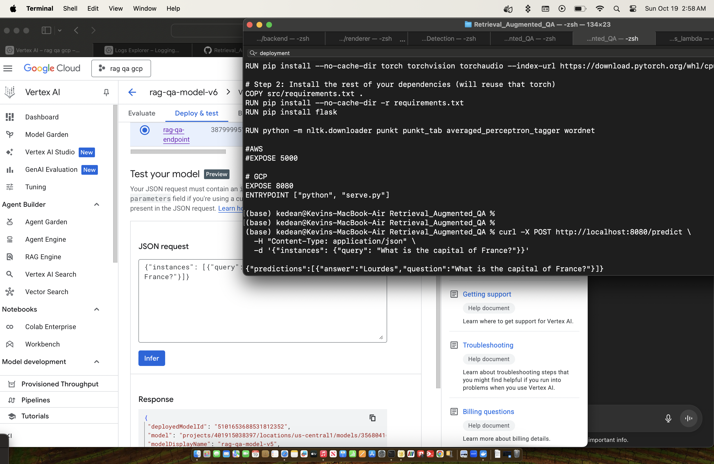

# RAG-QA Vertex AI Deployment

## Overview
This project deploys a **Retrieval-Augmented Generation (RAG) Question-Answering (QA) pipeline** as a custom container on **Google Cloud Vertex AI**. The pipeline uses a Flask server to expose health and prediction endpoints.

---

## Step 1: Authenticate with GCP
```bash
gcloud auth login
gcloud auth application-default login
gcloud config set project rag-qa-gcp
gcloud config set ai/region us-central1
```

Authenticate Docker to push images:
```bash
gcloud auth configure-docker us-central1-docker.pkg.dev
```

Problem Encountered:
- `docker push` failed with `authentication failed`.
Solution:
-Run `gcloud auth configure-docker us-central1-docker.pkg.dev` to authorize Docker.

---

## Step 2: Build Docker Image
```bash
export DOCKER_BUILDKIT=1                                   
docker buildx build --provenance=false --output type=docker --platform linux/amd64 -t rag-qa:latest .
```

Dockerfile Notes:
- Python 3.10 slim
- CPU-only PyTorch
- Install Flask & requirements
- NLTK downloads
- `EXPOSE 5000` (local testing) or `8080` for Vertex AI
- `ENTRYPOINT ["python", "serve.py"]`

Problem Encountered:
- On Vertex AI, container must listen on port 8080.
Solution:
- `Set app.run(host="0.0.0.0", port=int(os.environ.get('AIP_HTTP_PORT', 8080)))` in `serve.py`.

---

## Step 3: Tag and Push Docker Image
```bash
docker tag rag-qa:latest us-central1-docker.pkg.dev/rag-qa-gcp/rag-qa-repo/rag-qa:latest
docker push us-central1-docker.pkg.dev/rag-qa-gcp/rag-qa-repo/rag-qa:latest
```

Problems Encountered:
- Artifact Registry API not enabled.
- Permissions error for Vertex AI Service Agent.
Solutions:
- Enable Artifact Registry API via GCP Console.
- Grant Artifact Registry Reader/Writer roles to `service-<account-id>@gcp-sa-aiplatform.iam.gserviceaccount.com`.

---

## Step 4: Upload Model to Vertex AI
```bash
gcloud ai models upload \
  --region=us-central1 \
  --display-name="rag-qa-model-v5" \
  --container-image-uri="us-central1-docker.pkg.dev/rag-qa-gcp/rag-qa-repo/rag-qa:latest" \
```

Problems Encountered:
- Incorrect `--container-predict-route` or `/predict` not handled correctly in `serve.py`.
- Container ran but endpoint returned metadata only.
Solutions:
- Update `serve.py` to handle Vertex AI environment variables:
  - `AIP_HEALTH_ROUTE`
  - `AIP_PREDICT_ROUTE`
  - `AIP_HTTP_PORT`
- Make sure Flask endpoint returns:
```bash
{"predictions": [{"answer": "..."}]}
```

---

## Step 5: Create Endpoint (if needed)
```bash
gcloud ai endpoints create \
  --region=us-central1 \
  --display-name="rag-qa-endpoint"
```

---

## Step 6: Deploy Model to Endpoint
```bash
# find endpoint and model ids
gcloud ai endpoints list --region=us-central1
gcloud ai models list --region=us-central1

gcloud ai endpoints deploy-model <ENDPOINT_ID> \
  --region=us-central1 \
  --model=<MODEL_ID> \
  --display-name="rag-qa-deployment-v5" \
  --machine-type="n1-standard-4" \
  --min-replica-count=1 \
  --max-replica-count=1
```

---

## Test Predictions
Step 7a: Create JSON Request File
```bash
echo '{"instances": [{"query": "What is the capital of France?"}]}' > input.json
```

Step 7b: Run Prediction
```bash
gcloud ai endpoints predict <ENDPOINT_ID> \
  --region=us-central1 \
  --json-request=input.json
```



Common Problems & Fixes:
1. `No such file or directory` → create a JSON file instead of inline string.
2. `missing "instances" attribute` → wrap requests under `"instances"` key.
3. Metadata-only response → ensure Flask returns:
```bash
return jsonify({"predictions": results}), 200
```
4. Vertex AI expects port 8080 → use `os.environ.get("AIP_HTTP_PORT", 8080)` in `serve.py`.

---

## Step 8: Local Testing (Optional)
```bash
python serve.py
curl -X POST http://localhost:8080/predict \
  -H "Content-Type: application/json" \
  -d '{"instances": [{"query": "What is the capital of France?"}]}'
```

- Should return:
```bash
{"predictions": [{"answer": "Paris"}]}
```

---

## Step 9: Logging & Troubleshooting
- Use GCP Console → Vertex AI → Endpoints → Logs tab to inspect container logs.
- Use `INFO:werkzeug` logs to confirm HTTP requests hitting Flask.
- Ensure `"predictions"` key exists in JSON response.

---

## Key Lessons Learned

| Problem | Solution |
|---------|---------|
| Docker push failed (auth) | `gcloud auth configure-docker us-central1-docker.pkg.dev` |
| Vertex expects port 8080 | Use `AIP_HTTP_PORT` environment variable |
| Vertex expects `"instances"` key | Wrap JSON requests under `"instances"` |
| Vertex only returns metadata | Ensure Flask returns `{"predictions": results}` |
| Deployment seems stuck | Monitor with `gcloud ai operations list/describe` |
